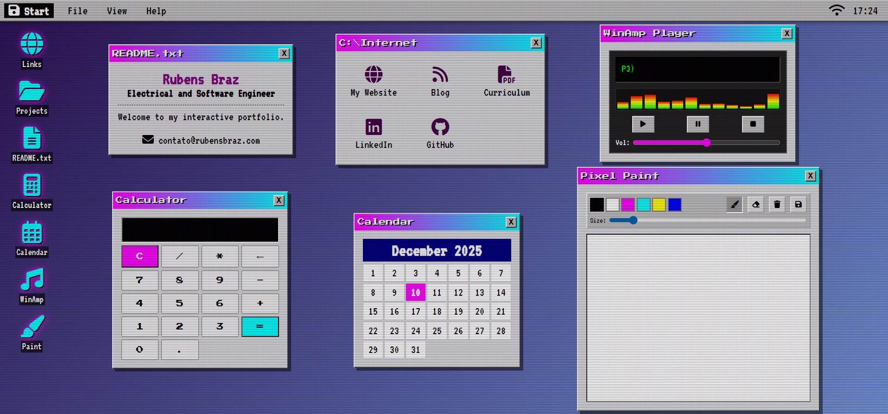

# 💾 RubensOS

> **A Retro Web Desktop Experience.**

<div align="center">
  <br />
  <a href="https://rubensbraz.github.io/">
    
  </a>
  <br />
  <br />
  
</div>

## 📖 About The Project

**RubensOS** is a fully interactive, web-based operating system inspired by the aesthetics of the 90s and the Vaporwave music subculture. It serves as a creative portfolio, allowing users to navigate through draggable windows, manage applications, and discover hidden features.

This project was built to demonstrate the power of **Vanilla JavaScript** using modern Object-Oriented Programming (OOP) patterns, without reliance on heavy frameworks.

## 🚀 Applications & Features

### 🎵 Winamp Media Player (Hybrid Engine)

A fully functional music player built to mimic the legendary Winamp.

* **Hybrid Core:** Tries to stream via YouTube API first. If restricted (Error 150), it automatically falls back to a direct MP3 stream from the Internet Archive.
* **Visualizer:** Dynamic CSS-based frequency bars that animate during playback.
* **Controls:** Volume slider, Play, Pause, Stop, and Track Info marquee.

### 🎨 Pixel Paint

A robust drawing tool for creating pixel art.

* **Tools:** Brush, Eraser, and Clear Canvas.
* **Customization:** Adjustable brush size slider and color palette.
* **Export:** Save your masterpieces directly to your computer as `.png` files.

### 🧮 Calculator & 📅 Calendar

* **Calculator:** Functional logic for basic arithmetic operations with error handling.
* **Calendar:** Dynamically generates the current month's view based on the user's system date.

### 🖥️ System Features

* **Window Manager:** Complete drag-and-drop system with active Z-index management (clicking a window brings it to the front).
* **CRT Effect:** Toggleable CRT monitor overlay (scanlines and flicker) via the "View" menu.
* **Boot Sequence:** Retro BIOS-style loading screen.

## 🐇 Easter Eggs

**The Matrix Mode**
* Type the **Konami Code** on your keyboard to hack the system:
    `↑ ↑ ↓ ↓ ← → ← → B A`
* *Result:* Triggers a Matrix Digital Rain effect rendered on a background HTML5 Canvas.

## 🛠️ Built With

* **HTML5** (Semantic structure)
* **CSS3** (Variables, Flexbox, Grid, Animations, CRT Filters)
* **JavaScript (ES6+)** (Classes, Async/Await, DOM Manipulation, YouTube API)

## 📦 Local Installation

1. Clone the repository:

    ```bash
    git clone [https://github.com/rubensbraz/rubensbraz.github.io.git](https://github.com/rubensbraz/rubensbraz.github.io.git)
    ```

2. Navigate to the folder:

    ```bash
    cd rubensbraz.github.io
    ```

3. **Important:** Due to browser security policies (CORS) regarding the YouTube API and Modules, you must run this project using a local server.
    * *VS Code:* Right-click `index.html` and select **"Open with Live Server"**.
    * *Python:* `python -m http.server`
    * *Node:* `npx serve`

## 📄 License

**Creative Commons Attribution-NonCommercial 4.0 International (CC BY-NC 4.0)**

This project is licensed under the CC BY-NC 4.0 license.

* ✅ **You are free to:** Share, copy, and adapt the material.
* ❌ **NonCommercial:** You may not use the material for commercial purposes.
* ✍️ **Attribution:** You must give appropriate credit to **Rubens Braz**, provide a link to the license, and indicate if changes were made.

See the `LICENSE` file for more details.

---

<div align="center">
  <sub>Built by <a href="https://github.com/rubensbraz">Rubens Braz</a></sub>
</div>